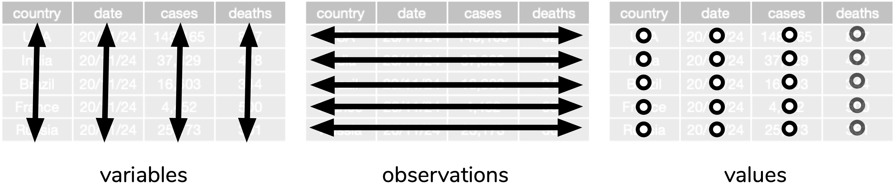

```{r, include = FALSE}
current_file <- knitr::current_input()
```
```{r titleslide, child="assets/titleslide.Rmd"}
```

---

# Base R

.margin-lr[
* **Base R** refers to the state of R when just launched in a clean interactive development environment (IDE, e.g. RStudio).

{{content}}

]

--

* In this state, R attached the following packages: 
   - `base`,
   - `methods`, <span class="font_small">for complex reasons, you may need to explicitly call this when using Rscript and package development!</span>
   - `stats`, 
   - `graphics`, 
   - `grDevices`, 
   - `utils`,  and
   - `datasets`.

---

# Tidyverse

* What packages does `library(tidyverse)` load?
--

* **Tidyverse** refers to a collection of R-packages: `ggplot2`, `dplyr`, `tidyr`, `readr`, `purrr`, `tibble`, `stringr`, `forcats`, `DBI`, `haven`, `httr`, `readxl`, `rvest`, `jsonlite`, `xml2`, `lubridate`, `hms`, `blob`, `magrittr`, `glue` and more recently, `tidymodels`. 

---

count: false

# Tidyverse

* What packages does `library(tidyverse)` load?
* **Tidyverse** refers to a collection of R-packages: .monash-blue[`ggplot2`], .monash-blue[`dplyr`], .monash-blue[`tidyr`], .monash-blue[`readr`], .monash-blue[`purrr`], .monash-blue[`tibble`], .monash-blue[`stringr`], .monash-blue[`forcats`], `DBI`, `haven`, `httr`, `readxl`, `rvest`, `jsonlite`, `xml2`, `lubridate`, `hms`, `blob`, `magrittr`, `glue` and more recently, `tidymodels`. 
* Eight of these packages form the **core tidyverse**.

<center>
 
</center>
* .monash-blue[`library(tidyverse)`] is a short hand for `library(ggplot2)`,  `library(dplyr)`, ..., `library(forcats)`

.footnote[
Wickham, H. et al. 2019. “Welcome to the Tidyverse.” Journal of Open. https://joss.theoj.org/papers/10.21105/joss.01686.
]

---

# Base R and Tidyverse

.margin-lr[
* Tidyverse is not a substitute for Base R 📘
{{content}}
]

--
* Knowing Base R is essential to use Tidyverse effectively 📗
{{content}} 
--
* Data wrangling in Tidyverse just gives you a different flavour of how you can do things in Base R 🍭
{{content}}
--
* All data wrangling can be achieved using Base R, so why load extra package(s) to deal with the data wrangling? 🤔
{{content}}
--
* Tidyverse packages share a common design philosophy, grammar and data structure
{{content}}
--
* This trains your mental model to do data science tasks in a certain manner which may make it easier, faster, and/or fun for you to do these tasks
{{content}}
--
* It's an opinionated approach so you should make a decision for yourself of what works for you _and_ others that you share your work with

---

# `data.frame` .font_small[Base R]

* In R, `data.frame` is a special class of `list` 
* Every column in the `data.frame` is a vector of the same length
* Each entry in a vector have the same type, e.g. logical, integer, double (or numeric), character or factor.
* It has an attribute `row.names` which could be a sequence of integers indexing the row number or some unique identifier

.grid[.item[
```{r}
cars
```
]
.item[
```{r}
mtcars
```

]

]

---

# Tidy data 

.center[
🎯 The typical aim of data wrangling is to make data into a **tidy data**
]

.info-box[
**Definition of a tidy data**
* Each variable must have its own column
* Each observation must have its own row
* Each value must have its own cell
]

<center>

</center>

.footnote[
Wickham, Hadley. 2014. “Tidy Data.” Journal of Statistical Software, Articles 59 (10): 1–23.
]

---

class: transition middle

# Data wrangling with <br> Base R

---

# Subsetting by column .font_small[Base R .font_small[Part ]1] 

.grid[
.item[
By column names
```{r}
mtcars[, c("mpg", "cyl")] 
```

]
.item[
By index
```{r}
mtcars[, 1:2] 
```
]

]

---

# Subsetting by column .font_small[Base R .font_small[Part ]2] 

.grid[
.item[
By column names
```{r}
mtcars[c("mpg", "cyl")] 
```

]
.item[
By index
```{r}
mtcars[1:2] 
```
]

]

---

# Lists .font_small[Base R]

* Remember, `data.frame` is just a special type of `list` and inherit methods applied for `list`.

.grid[
.item[
```{r}
x <- list( int = 1:3, 
          shop = c("apple", "pear"), 
                 c(2020, 12, 1, 1.3))
x
```

]
.item[
{{content}}
]
]

--

```{r}
x[c("int", "shop")]
```
{{content}}
--

Double square bracket to access inside the list

```{r}
x[["int"]] # or x$int
```

---

# `list` and `data.frame` .font_small[Base R] 

```{r, error = TRUE}
x[, "int"] # this is a special operation for data frames
```
--
```{r}
mtcars[["cyl"]]
mtcars$cyl
```
--
```{r}
mtcars["cyl"]
```

--

<div class="info-box pad20" style="position:absolute!important;bottom:10px;width:500px;margin-left:40%;">
<code>data.frame</code> inherits methods for <code>list</code>, but <code>list</code> does not inherit methods for <code>data.frame</code>
</div>

---

# Subsetting by column .font_small[Base R]  <i class="fas fa-exclamation-triangle animated flash yellow"></i>

* If you subset _a single column_ using `[, ]`, then by default the output is a vector and not a `data.frame`.

```{r}
mtcars[, "mpg"]
```
--
* If you want to preserve the output as a `data.frame` then:

```{r}
mtcars[, "mpg", drop = FALSE]
```

---

# Subsetting by row .font_small[Base R .font_small[Part ]1]

By index:

```{r}
mtcars[3:1, ]
```

--

If it has row names:

```{r}
mtcars[c("Datsun 710", "Mazda RX4"), ]
```

---

# Subsetting by row .font_small[Base R .font_small[Part ]2]

Using a logical vector,

```{r}
mtcars[mtcars$mpg > 31, ]
```
--

Or using **non-standard evaluation**:

```{r}
subset(mtcars, mpg > 31)
```

--

Non-standard evaluation? We'll come back to this later.

---

# Adding or modifying a column .font_small[Base R]

Append the new column:

```{r}
df1 <- cbind(mtcars, gpm = 1 / mtcars$mpg)
```
--

Create a new column as you would a create a new object in a list:
```{r}
df1$gpm <- 1 / df1$mpg
df1[["gpm"]] <- 1 / df1$mpg
```

--

Overwrite column if modifying an existing column:
```{r}
df1$wt <- df1$gpm^2
df1[["wt"]] <- df1$gpm^2
```
--
Modify only a part of it:

```{r}
df1$wt[df1$cyl==6] <- 10
```


---

# Adding a row .font_small[Base R]

What do you notice with the order of the new entry?
```{r}
df2 <- rbind(cars, data.frame(dist = 10, speed = 3))
tail(df2, 3)
```

```{r}
df2 <- rbind(cars, c(10, 3))
tail(df2, 3)
```


---

# Sorting columns .font_small[Base R]

```{r}
mtcars[, sort(names(mtcars))]
```


---

# Sorting rows .font_small[Base R]

```{r}
order(mtcars$mpg)
mtcars[order(mtcars$mpg),]
```

---

# Calculating statistical summaries by group .font_small[Base R]

🎯 Calculate the _average_ weight (`wt`) of a car for each gear type in (`gear`)  `mtcars`

--

```{r}
tapply(mtcars$wt, mtcars$gear, mean)
```
--

🎯 Calculate the _median_ weight (`wt`) of a car for each gear (`gear`) and engine (`vs`) type in  `mtcars`
--

```{r}
tapply(mtcars$wt, list(mtcars$gear, mtcars$vs), median)
```

---

```{r exerciseslide, child="assets/exerciseslide.Rmd"}
```

---

```{r endslide, child="assets/endslide.Rmd"}
```
