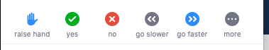

```{r, include = FALSE}
current_file <- knitr::current_input()
```
```{r titleslide, child="assets/titleslide.Rmd"}
```

---

<div class="grid" style="grid: 1fr / 1.2fr 2fr;">
<div class="item white monash-bg-blue border-right">
<br>

<div class="circle-image">
<center>

</center>
</div>

**Emi Tanaka** <br>
*Lecturer in Statistics*<br>
Monash University

<br>

<i class="fas fa-globe"></i> https://emitanaka.org/

<i class="fas fa-envelope"></i> emi.tanaka@monash.edu

<i class="fab fa-twitter"></i> @statsgen

</div>

<div class="item">

<h1>About your instructor</h1>

<ul>
<li>I teach R at university courses as well as use it daily for research and hobby `r anicon::faa("reddit-alien", animate = "spin", anitype = "hover")`</li>
<li>My research includes mixed models, experimental design, statistical genetics and data visualisation.</li>
<li>My main application area is bioinformatics and agricultural, particularly plant breeding.</li>
<li>My childhood dream was to be a comic artist.. it's not too late, is it?</li>
<!-- <div class="calendar"> -->
<!--     Loading github commits data. -->
<!-- </div> -->
</ul>
</div>

</div>

---

<div class="grid" style="grid: 1fr / 1.2fr 2fr;">
<div class="item white monash-bg-blue border-right">
<br>

<div class="circle-image">
<center>

</center>
</div>

**Fan Cheng** <br>
*PhD Student*<br>
Monash University

<br>

<i class="fas fa-globe"></i> https://fancheng.me/

<i class="fas fa-envelope"></i> Fan.Cheng@monash.edu

<i class="fab fa-twitter"></i> @fanchengfc

</div>

<div class="item">

<h1>About your helper</h1>

<ul>
<li>I am a second-year PhD student in Statistics at Monash</li>
<li>I work for the Monash Data Fluency team to teach workshops on R, Python, Git and Unix</li>
<li>My research project is about manifold learning based on empirical probability distributions. If you are interested, I am more than happy to talk about it :)</li>
</ul>
</div>

</div>


---

class: center middle


<i class="fas fa-user-alt monash-blue font_large animated bounce"></i>

.font_large.monash-blue[Introduce yourself in the chat!]

<br>

What's your profession?  

Where do you live?

What's your hobby? 

What's would you like for people to know about you? 


---

# Day 1 Schedule

<center>
Tue 1st Dec 2020 
</center>

```{r day1, echo = FALSE, results="asis"}
cat(readLines(here::here("schedule/schedule-day1.md")), sep = "\n")
```


---

# Day 2 Schedule

<center>
Wed 2nd Dec 2020 
</center>

```{r day2, echo = FALSE, results="asis"}
cat(readLines(here::here("schedule/schedule-day2.md")), sep = "\n")
```


---


# Getting Started

```{r, eval = FALSE}
remotes::install_github("emitanaka/dwexercise")
```


.info-box.pad20[
* Find the latest updated material at .blue[<i class="fas fa-globe"></i> http://emitanaka.org/datawrangle-workshop-ssavic/]
* All materials are hosted in GitHub repo [here](https://github.com/emitanaka/datawrangle-workshop-ssavic)
* All exercises are hosted as an R-package on GitHub repo [here](https://github.com/emitanaka/dwexercise)
* You can download the current material [here](https://github.com/emitanaka/datawrangle-workshop-ssavic/archive/main.zip)
]

.font_small[
* Some materials may be updated before the workshop is completed so it will be better to re-download the latest material at the conclusion of the workshop. 
* I will send you a follow up email with link to download all material
]

---

class: center

# Help me!

<br><br>

You can write in the chat.

<br>

You can ask (unmute yourself).

<br>

You can raise hand from zoom under Participants.



<br>

We'll come around in breakout sessions.


---

```{r endslide, child="assets/endslide.Rmd"}
```
