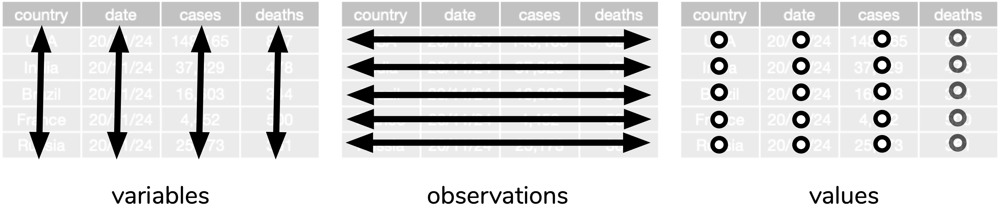

```{r, include = FALSE}
data(census_2016_STE, package = "dwexercise")
current_file <- knitr::current_input()
library(tidyverse)
knitr::opts_chunk$set(cache = TRUE,
                      cache.path = "cache/")
```
```{r titleslide, child="assets/titleslide.Rmd"}
```

---

# Recall tidy data

.info-box[
**Definition of a tidy data**
* Each variable must have its own column
* Each observation must have its own row
* Each value must have its own cell
]

<center>

</center>

.footnote[
Wickham, Hadley. 2014. “Tidy Data.” Journal of Statistical Software, Articles 59 (10): 1–23.
]

---

# Is this tidy data? .font_small[.font_small[Part] 1]

.grid[.item[

```{r, echo = FALSE}
df1 <- tibble(state = c("NSW", "VIC", "ACT"),
       `2019` = c(8130159, 6655284, 427892),
       `2018` = c(80366651, 6528601, 423169),
       `2017` = c(7919815, 6387081, 415874))
knitr::kable(df1, caption = "Estimated residential population in December") %>% 
  kableExtra::kable_styling()
```


]

{{content}}
]

.footnote[
Values adapted from Australian Bureau of Statistics. (2020). Table 04. Estimated Resident Population, States and Territories [Time series spreadsheet]. National, state and territory population, Australia Mar 2020. Retrieved Nov 24, 2020. https://www.abs.gov.au/statistics/people/population/national-state-and-territory-population/mar-2020/310104.xls
]

--

<div class="item center">
```{r, echo = FALSE}
df1 %>% 
  pivot_longer(-state, names_to = "year", values_to = "population") %>% 
  knitr::kable(caption = "Estimated residential population in December") %>% 
  kableExtra::kable_styling()
```
</div>

---

name: ste-part2

# Is this tidy data? .font_small[.font_small[Part] 2]

```{css, echo = FALSE}
.width100 {
  width: 100%;
  overflow: scroll;
}
.ste tr {
  font-size: 14pt!important;
}
.ste tr:nth-child(even)  { background: #cceeff!important; }
.ste tr:nth-child(odd)  { background: #4dc3ff!important; }
.ste th {background: #006699; color:white;}
.scroll-vert {
  height: 500px!important;
  overflow:scroll;
}
```
Total weekly personal income by age and sex from ABS 2016 Census
.width100[
```{r, echo = FALSE}
data(census_2016_G17, package = "dwexercise")
census_2016_G17 %>% 
  knitr::kable() %>% 
  kableExtra::kable_styling()
```
]
What do you think the headers mean?


.footnote[
Based on Australian Bureau of Statistics 2016 Census Data
]

<!-- Note: above is using citation instruction from CreativeCommons_Licensing_readme.txt in the data pack with slight addition of 2016 Census -->


<div class="bg-white" style="border:3px black solid;position:absolute;bottom:10px;right:10px;">
```{r, echo = FALSE}
census_2016_STE %>% 
  knitr::kable(caption = "STE Code") %>% 
  kableExtra::kable_styling(htmltable_class = "table ste")
```
</div>

<a class="tag" style="position:absolute;top:10px;right:10px;" href="#pivot-part2"><i class="fas fa-code"></i></a>

--


---

name: census-long

# Is this tidy data? .font_small[.font_small[Part] 3]

.scroll-vert[
```{r, echo = FALSE}
df3 <- census_2016_G17 %>% 
  pivot_longer(-STE_CODE_2016,
               values_to = "count",
               names_to = "group") %>%
  left_join(census_2016_STE, by = c("STE_CODE_2016" = "code")) %>% 
  select(state = name, group, count) 
census_long <- df3
knitr::kable(df3, caption = "Total weekly personal income by age and sex") %>% 
  kableExtra::kable_styling()
```
]

.footnote[
Based on Australian Bureau of Statistics 2016 Census Data
]

<a class="tag" style="position:absolute;top:10px;right:10px;" href="#extract-part1"><i class="fas fa-code"></i></a>

---

name: tidy-part4

# Is this tidy data? .font_small[.font_small[Part] 4]

.scroll-vert[
```{r, echo = FALSE, warning = FALSE, message = FALSE}
df4 <- df3 %>% 
  filter(!str_detect(group, "Tot")) %>% 
  filter(!str_starts(group, "P")) %>% 
  extract(group, 
           into = c("sex", "income_min", "income_max", "age_min", "age_max"),
           regex = "^([FM])_(\\d+|Neg_Nil|Negtve_Nil|PI)_(\\d+|more|income|incme|NS_ns|NS)_(\\d+)_?(\\d+)?",
          remove = TRUE) %>% 
  mutate(income_min = case_when(str_detect(income_min, "Neg") ~ -Inf,
                                TRUE ~ as.numeric(income_min)),
         income_max = case_when(income_max %in% c("income", "incme") ~ 0,
                                income_max %in% "more" ~ Inf,
                                    TRUE ~ as.numeric(income_max)),
         age_min = as.numeric(age_min),
         age_max = ifelse(age_max=="", Inf, as.numeric(age_max))) 
knitr::kable(df4, caption = "Total weekly personal income by age and sex") %>% 
  kableExtra::kable_styling()
```
]

.footnote[
Based on Australian Bureau of Statistics 2016 Census Data
]

<a class="tag" style="position:absolute;top:10px;right:10px;" href="#pivot-part3"><i class="fas fa-code"></i></a>

---

name: tidy-part5

# Is this tidy data? .font_small[.font_small[Part] 5]

.grid[
.item[
```{r, echo = FALSE}
data(nass.barley, package = "agridat")
data(nass.wheat, package = "agridat")
df5 <- rbind(mutate(nass.barley, crop = "barley"), 
             mutate(nass.wheat, crop = "wheat")) %>% 
  select(year, state, crop, yield, acres) %>% 
  filter(state %in% c("Iowa", "Kansas")) %>% 
  filter(year %in% c(1900, 2000))
# have to shorten otherwise doesn't seem to be loading
# may have too many elements in html text area?
knitr::kable(select(df5, -acres), caption = "U.S. historical crop yields by state") %>% 
  kableExtra::kable_styling()
```
]
{{content}}
]

.footnote[
United States Department of Agriculture, National Agricultural Statistics Service. http://quickstats.nass.usda.gov/

Kevin Wright (2020). agridat: Agricultural Datasets. R package version 1.17
]

--

<div class="item">
<br>

```{r, echo = FALSE}
pivot_wider(select(df5, -acres), names_from = crop, values_from = yield, names_glue = "{crop}_yield") %>% 
  knitr::kable(caption = "U.S. historical crop yields by state") %>% 
  kableExtra::kable_styling()
```
</div>

---

name: tidy-part6

# Is this tidy data? .font_small[.font_small[Part] 6]


.grid[
.item[
.scroll-vert[
```{r, echo = FALSE}
pivot_longer(df5, yield:acres, values_to = "value", names_to = "metric")  %>% 
  knitr::kable(caption = "U.S. historical crop yields by state") %>% 
  kableExtra::kable_styling()
  
```
]]
{{content}}
]

.footnote[
United States Department of Agriculture, National Agricultural Statistics Service. http://quickstats.nass.usda.gov/

Kevin Wright (2020). agridat: Agricultural Datasets. R package version 1.17
]

--

<div class="item">
<br>

```{r, echo = FALSE}
pivot_wider(df5, names_from = crop, values_from = c(yield, acres), names_glue = "{crop}_{.value}") %>% 
  knitr::kable(caption = "U.S. historical crop yields by state") %>% 
  kableExtra::kable_styling()
```
</div>

.footnote[
United States Department of Agriculture, National Agricultural Statistics Service. http://quickstats.nass.usda.gov/

Kevin Wright (2020). agridat: Agricultural Datasets. R package version 1.17
]

--

<div class="bg-white" style="position:absolute;bottom:10px;right:50px;">
```{r, echo = FALSE}
df5 %>% 
  knitr::kable() %>% 
  kableExtra::kable_styling(htmltable_class = "ste")
```
</div>

---

class: center middle 

## Some signs of non-tidy data


### .circle.white.bg-blue[1] Header has meaningful information

<br><br>

### .circle.white.bg-blue[2] Cells have multiple values


---

# Wide and long data formats

.grid[
.item[

]
.item[

* Transforming data from wide to long or vice versa is referred to as **pivotting**
{{content}}
]

]

.footnote[
Picture credit: Garrick Aden-Buie
]

--

* Sometimes the long form is referred to as **molten data**
{{content}}
--
* Some people may refer to transforming data from wide to long as **melting** the data and vice-versa as **casting**


---

# Evolving language

* Earlier efforts to transform data from wide to long was in the `reshape`, first released on CRAN in 2005-08-05
* It was then superseded by `reshape2` released on CRAN in 2010-09-10
* Then finally `tidyr` released on CRAN in 2014-07-21 .font_small[[<sup>*</sup>v1.0.0 released 2019-09-12](https://www.tidyverse.org/blog/2019/09/tidyr-1-0-0/)]

.grid[
.item[
**Wide to long**

* `reshape::melt` 
* `reshape2::melt` 
* `tidyr::gather` 
* **`tidyr::pivot_longer`**<sup>*</sup>


]
.item[
**Long to wide**

* `reshape::cast` 
* `reshape2::dcast` 
* `tidyr::spread` 
* **`tidyr::pivot_wider`**<sup>*</sup>


]

]

.footnote[

Hadley Wickham (2020). tidyr: Tidy Messy Data. R
  package version 1.1.2.
  
Hadley Wickham (2007). Reshaping Data with the reshape
  Package. Journal of Statistical Software, 21(12), 1-20
  
]

---

# Pivotting data with `tidyr` .font_small[.font_small[Part] 1]


.grid[.item[

```{r, echo = FALSE}
df_wide <- df1
knitr::kable(df1, caption = "df_wide") %>% 
  kableExtra::kable_styling()
```
```{r, eval = FALSE}
pivot_longer(df_wide, cols = `2019`:`2017`, 
             names_to = "year",
             values_to = "population")

pivot_wider(df_long, id_cols = state,
            names_from = year, 
            values_from = population)
```


]

<div class="item center">
```{r, echo = FALSE}
df_long <- df1 %>% 
  pivot_longer(-state, names_to = "year", values_to = "population")
knitr::kable(df_long, caption = "df_long") %>% 
  kableExtra::kable_styling()
```
</div>
]

.footnote[
Values adapted from Australian Bureau of Statistics. (2020). Table 04. Estimated Resident Population, States and Territories [Time series spreadsheet]. National, state and territory population, Australia Mar 2020. Retrieved Nov 24, 2020. https://www.abs.gov.au/statistics/people/population/national-state-and-territory-population/mar-2020/310104.xls
]

---

name: pivot-part2

# Pivotting data with `tidyr` .font_small[.font_small[Part] 2]

```{r}
data(census_2016_G17, package = "dwexercise")
```

<a class="tag" style="position:absolute;top:10px;right:10px;" href="#ste-part2"><i class="fas fa-caret-right"></i> table</a>

--

.grid[
.item50[
**wide format**
```{r}
as_tibble(census_2016_G17)
```
]
.item[
**long format**

```{r}
pivot_longer(census_2016_G17,
             cols = -STE_CODE_2016,
             names_to = "group",
             values_to = "count")
```

]

]


---


# Pivotting data with `tidyr` .font_small[.font_small[Part] 3]

.grid[
.item[
```{r, echo = FALSE}
knitr::kable(select(df5, -acres), caption = "yield_long") %>% 
  kableExtra::kable_styling()
```
]
.item[
```{r, echo = FALSE}
pivot_wider(select(df5, -acres), names_from = crop, values_from = yield, names_glue = "{crop}_yield") %>% 
  knitr::kable(caption = "yield_wide") %>% 
  kableExtra::kable_styling()
```

yield_long <i class="fas fa-arrow-right"></i> yield_wide

{{content}}


]

]

.footnote[
United States Department of Agriculture, National Agricultural Statistics Service. http://quickstats.nass.usda.gov/

Kevin Wright (2020). agridat: Agricultural Datasets. R package version 1.17
]

--

```{r, eval = FALSE}
pivot_wider(yield_long, 
            id_cols = c(year, state),
            names_from = crop, 
            values_from = yield, 
            names_glue = "{crop}_yield") #<<
```

---

# Pivotting data with `tidyr` .font_small[.font_small[Part] 4]

.grid[
.item[
```{r, echo = FALSE}
knitr::kable(select(df5, -acres), caption = "yield_long") %>% 
  kableExtra::kable_styling()
```
]
.item[
```{r, echo = FALSE}
pivot_wider(select(df5, -acres), names_from = crop, values_from = yield, names_glue = "{crop}_yield") %>% 
  knitr::kable(caption = "yield_wide") %>% 
  kableExtra::kable_styling()
```
yield_wide <i class="fas fa-arrow-right"></i> yield_long

{{content}}


]

]

.footnote[
United States Department of Agriculture, National Agricultural Statistics Service. http://quickstats.nass.usda.gov/

Kevin Wright (2020). agridat: Agricultural Datasets. R package version 1.17
]

--

```{r, eval = FALSE}
pivot_longer(yield_wide, 
             cols = contains("yield"), 
             names_to = "crop", 
             names_pattern = "(.+)_yield",  #<<
             values_to = "yield", 
             values_drop_na = TRUE)
```


---

# Pivotting data with `tidyr` .font_small[.font_small[Part] 5]

.grid[
.item[
.scroll-vert[
```{r, echo = FALSE}
pivot_longer(df5, yield:acres, values_to = "value", names_to = "metric")  %>% 
  knitr::kable(caption = "crop_long") %>% 
  kableExtra::kable_styling()
  
```
]]
.item[
```{r, echo = FALSE}
pivot_wider(df5, names_from = crop, values_from = c(yield, acres), names_glue = "{crop}_{.value}") %>% 
  knitr::kable(caption = "crop_wide") %>% 
  kableExtra::kable_styling()
```

crop_long <i class="fas fa-arrow-right"></i> crop_wide

{{content}}
]
]

.footnote[
United States Department of Agriculture, National Agricultural Statistics Service. http://quickstats.nass.usda.gov/

Kevin Wright (2020). agridat: Agricultural Datasets. R package version 1.17
]

--

```{r, eval = FALSE}
pivot_wider(crop_long, 
            names_from = c(crop, metric), 
            values_from = value, 
            names_glue = "{crop}_{metric}") #<<
```

---

# Pivotting data with `tidyr` .font_small[.font_small[Part] 6]

.grid[
.item[
.scroll-vert[
```{r, echo = FALSE}
pivot_longer(df5, yield:acres, values_to = "value", names_to = "metric")  %>% 
  knitr::kable(caption = "crop_long") %>% 
  kableExtra::kable_styling()
  
```
]]
.item[
```{r, echo = FALSE}
pivot_wider(df5, names_from = crop, values_from = c(yield, acres), names_glue = "{crop}_{.value}") %>% 
  knitr::kable(caption = "crop_wide") %>% 
  kableExtra::kable_styling()
```

crop_wide <i class="fas fa-arrow-right"></i> crop_long

{{content}}
]
]

.footnote[
United States Department of Agriculture, National Agricultural Statistics Service. http://quickstats.nass.usda.gov/

Kevin Wright (2020). agridat: Agricultural Datasets. R package version 1.17
]

--

```{r, eval = FALSE}
pivot_longer(crop_wide, 
             cols = -c(year, state),
            names_to = c("crop", "metric"), 
            names_pattern = "(.+)_(.+)",
            values_to = "value")
```


---

name: pivot-part3

# Pivotting data with `tidyr` .font_small[.font_small[Part] 7]
.width100[
```{r, echo = FALSE}
census_2016_G17[1,] %>% 
  knitr::kable()
```
]


<a class="tag" style="position:absolute;top:10px;right:10px;" href="#tidy-part4"><i class="fas fa-caret-right"></i> table</a>

--

.scroll-vert[
```{r, message = FALSE, warning = FALSE}
census_2016_G17 %>% 
  pivot_longer(cols = -STE_CODE_2016,
               names_to = c("sex", "income_min", "income_max", "age_min", "age_max"),
               names_pattern = "^([FM])_(\\d+|Neg_Nil|Negtve_Nil|PI)_(\\d+|more|income|incme|NS_ns|NS)_(\\d+)_?(\\d+)?",
               values_to = "count",
               names_transform = list(
                 income_min = function(x) case_when(str_detect(x, "Neg") ~ -Inf,
                                                                    TRUE ~ as.numeric(x)),
                 income_max = function(x) case_when(x %in% c("income", "incme") ~ 0,
                                                                  x %in% "more" ~ Inf,
                                                                          TRUE ~ as.numeric(x)),
                 age_min = as.numeric,
                 age_max = function(x) ifelse(x=="", Inf, as.numeric(x)))) %>% 
  filter(!is.na(sex)) 
```
]


---

name: extract-part1

# Extract values into multiple columns 


Alternatively, we could pivot all column names except `STE_CODE_2016` to a single column as in <a class="tag" href="#census-long"><i class="fas fa-caret-right"></i> table</a> and then extract the values from cells

--

.scroll-vert[
```{r, warning = FALSE, message = FALSE}
census_2016_G17 %>% 
  pivot_longer(cols = -STE_CODE_2016,
               names_to = "group",
               values_to = "value") %>% 
  filter(!str_detect(group, "Tot"),
         !str_starts(group, "P")) %>% 
  extract(group, #<<
          into = c("sex", "income_min", "income_max", "age_min", "age_max"),#<<
          regex = "^([FM])_(\\d+|Neg_Nil|Negtve_Nil|PI)_(\\d+|more|income|incme|NS_ns|NS)_(\\d+)_?(\\d+)?",#<<
          remove = TRUE) %>% #<<
  mutate(income_min = case_when(str_detect(income_min, "Neg") ~ -Inf,
                                                         TRUE ~ as.numeric(income_min)),
         income_max = case_when(income_max %in% c("income", "incme") ~ 0,
                                              income_max %in% "more" ~ Inf,
                                                                TRUE ~ as.numeric(income_max)),
         age_min = as.numeric(age_min),
         age_max = ifelse(age_max=="", Inf, as.numeric(age_max))) 
```
]


---

# Separate values into columns 

.grid[
.item[
```{r, echo = FALSE}
pkg_dat <- tribble(~package, ~maintainer,
        "dplyr", "Hadley Wickham",
        "magrittr", "Lionel Henry",
        "tidyr", "Hadley Wickham",
        "stringr", "Hadley Wickham",
        "rlang", "Lionel Henry",
        "tibble", "Kirill Müller",
        "tidyselect", "Lionel Henry",
        "RVerbalExpressions", "Tyler Littlefield") %>% 
  arrange(package)
pkg_dat %>% 
  knitr::kable(caption = "pkg_dat") %>% 
  kableExtra::kable_styling()
```

🎯 separate maintainer name to columns, first name and last name
]
.item[
```{r}
pkg_dat %>% 
  separate(maintainer, 
           into = c("first_name", "last_name"),
           sep = " ")
```


]
]

---

class: font_smaller

# Separate values into rows

.grid[
.item[
```{r, echo = FALSE}
author_dat <- tribble(~package, ~author,
        "dplyr", "Hadley Wickham, Romain François, Lionel Henry, Kirill Müller",
        "magrittr", "Lionel Henry, Stefan Milton Bache, Hadley Wickham",
        "tidyr", "Hadley Wickham",
        "stringr", "Hadley Wickham",
        "rlang", "Lionel Henry, Hadley Wickham",
        "tibble", "Kirill Müller, Hadley Wickham",
        "tidyselect", "Lionel Henry, Hadley Wickham",
        "RVerbalExpressions", "Tyler Littlefield") %>% 
  arrange(package)
author_dat %>% 
  knitr::kable(caption = "author_dat") %>% 
  kableExtra::kable_styling()
```

]
.item[
```{r}
author_dat %>% 
  separate_rows(author, sep = ", ")
```

]
]

---

```{r exerciseslide, child="assets/exerciseslide.Rmd"}
```

---

```{r endslide, child="assets/endslide.Rmd"}
```
