```{r, include = FALSE}
library(agridat)
library(broom)
library(janitor)
library(tidyverse)
current_file <- knitr::current_input()
knitr::opts_chunk$set(
  fig.path = "images/day2-session1/"
)
```
```{r titleslide, child="assets/titleslide.Rmd"}
```


---

class: transition middle

# Relational data 

---

class: middle center

## Do you rememember what the <br>definition of a .monash-blue[tidy data] is?

--

.info-box[
**Definition of a tidy data**
* Each variable must have its own column
* Each observation must have its own row
* Each value must have its own cell
]

---


# Observational unit

<div class="grid" style="grid: 1fr / 1fr 3fr;">
.item[

```{r, echo = FALSE, fig.width = 2, fig.align="center"}
expand_grid(x = 1:2, y = 1:3) %>% 
  mutate(col = case_when(
    x==2 ~ "#d0d0d0",
    y==1 ~ "#4DAF4A",
    y==2 ~ "#377EB8",
    y==3 ~ "#E41A1C"
  ), val = c("3", "2", "1", "x3", "x2", "x1")) %>% 
  mutate(across(where(is.numeric), as.factor)) %>% 
  ggplot(aes(x, y, fill = I(col))) + 
  geom_tile(width = 0.9, height = 0.9) + 
  theme_void() + 
  geom_text(color = "white", aes(label = val), size = 12) +
  coord_equal() 
```

]
.item[


* In the original definition in Wickham (2014), which was a statistical version of the definition in Codd (1990), the third point originally was actually:

<blockquote>
 Each type of observational unit forms a table.
</blockquote>

{{content}}

]
</div>

.footnote[
Codd EF. 1990. The Relational Model for Database Management:  Version 2. Addison-WesleyLongman Publishing, Boston.

Wickham, Hadley. 2014. “Tidy Data.” Journal of Statistical Software, Articles 59 (10): 1–23.
]

--

* What is an **observational unit**?

{{content}}

--

* It's the unit in which measurement is made, e.g. if measure height of a person then the person is the observational unit


---

# Multiple observational units in one table

.grid[
.item50[
```{r, echo = FALSE, comment = "#"}
tmp_df <- aastveit.barley.covs %>% 
  select(year, T1:T6) %>% 
  pivot_longer(-year, names_to = "period", values_to = "temperature") %>% 
  as.data.frame()
ht_df <- aastveit.barley.height %>% 
  rename(variety = gen)
df <- left_join(ht_df, tmp_df, by = "year") 
```
```{r}
df
```

]
.item[

* The data on the left shows the height of a barley variety at a given year in Norway experiment
* The temperature at six different time points of the growth barley was recorded 
* What's the observational unit here?

{{content}}

]
]

--

* Yes. there are two observational unit here: the barley and the environment at six different time points per year


---

# Related data sets

* Originally the data were in a separate table
* Notice before that the `height` measurements were duplicated
{{content}}

.grid[
.item[
```{r, echo = FALSE}
tmp_df
```

]
.item[
```{r, echo = FALSE}
ht_df
```

]

]

--
* While it's tidier to have it separated like this, you may need to join the data for downstream analysis


---

class: middle center

## So, how do you join two related data?

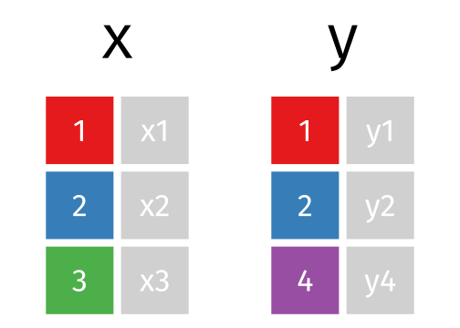

--

## Yes, you can only join the table if each table<br> has columns that you can join by


---

class: transition middle

# Joining datasets with `dplyr`

--

## There are are many ways to do so

---

layout: true

# Inner join

.grid[
.item[
{{content}}
]
.item[

<br><br>
* All rows from `x` where there are matching values in `y`, and all columns from `x` and `y`.
]
]

.footnote[
GIF credit: Garrick Aden-Buie
]

---


---

count: false

<br>
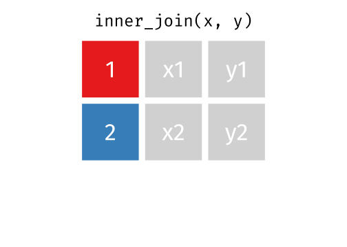

---

layout: false

# Left join

.grid[
.item[

* If there are multiple matches between x and y, all combinations of the matches are returned.
]
.item[
* All rows from `x`, and all columns from `x` and `y`. Rows in `x` with no match in `y` will have `NA` values in the new columns.


]
]

.footnote[
GIF credit: Garrick Aden-Buie
]

---


count: false

# Left join

.grid[
.item[
<br>
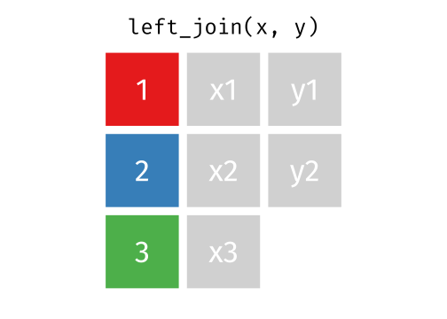

* If there are multiple matches between `x` and `y`, all combinations of the matches are returned.
]
.item[
* All rows from `x`, and all columns from `x` and `y`. Rows in `x` with no match in `y` will have `NA` values in the new columns.

<br>
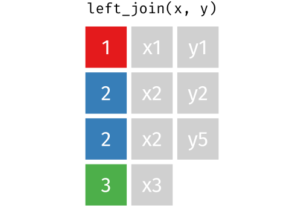
]
]

.footnote[
GIF credit: Garrick Aden-Buie
]


---

layout: true

# Right join 

.grid[
.item[
{{content}}
]
.item[

<br><br>
* All rows from `y`, and all columns from `x` and `y`. Rows in `y` with no match in x will have `NA` values in the new columns.


]
]

.footnote[
GIF credit: Garrick Aden-Buie
]

---


---

count: false

<br>

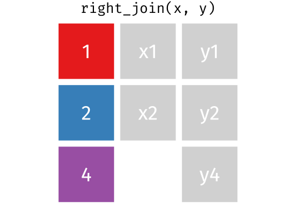


---

layout: true

# Full join 

.grid[
.item[
{{content}}
]
.item[
<Br><br>
* All rows and all columns from both `x` and `y`. Where there are not matching values, returns `NA` for the one missing.


]
]

.footnote[
GIF credit: Garrick Aden-Buie
]

---


---

count: false

<br>

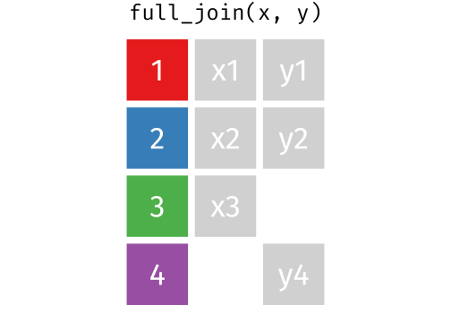

---

layout: true

# Semi join 

.grid[
.item[
{{content}}
]
.item[
<br><br>
* All rows from `x` where there are matching values in `y`, keeping just columns from `x`.


]
]

.footnote[
GIF credit: Garrick Aden-Buie
]

---


---

count: false

<br>
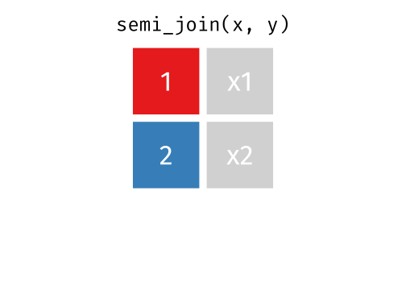


---

layout: true

# Anti join 

.grid[
.item[
{{content}}
]
.item[

<Br><br>

* All rows from `x` where there are not matching values in `y`, keeping just columns from `x`.


]
]

.footnote[
GIF credit: Garrick Aden-Buie
]


---


---

count: false

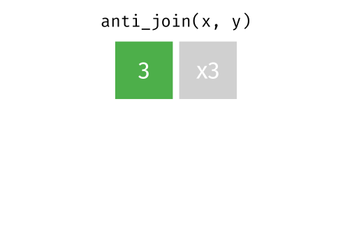

---

layout: false

class: transition middle

# Set Operations with <br>Relational Data

---

layout: true

# Union

.grid[
.item[
{{content}}
]
.item[

<br><br>
* All unique rows from `x` and `y`.

]
]

.footnote[
GIF credit: Garrick Aden-Buie
]


---


---

count: false

<br>
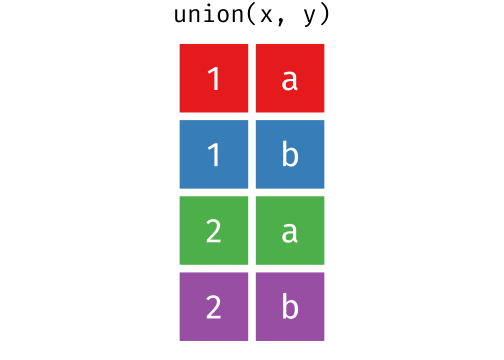

---

layout: true

# Union all

.grid[
.item[
{{content}}
]
.item[
<br><br>
* All rows from `x` and `y`, keeping duplicates.


]
]

.footnote[
GIF credit: Garrick Aden-Buie
]


---


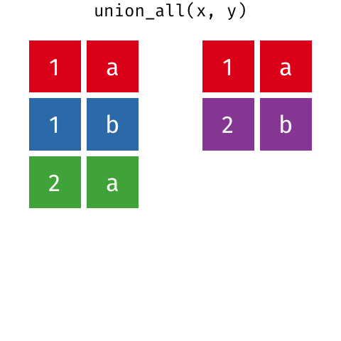

---

count: false

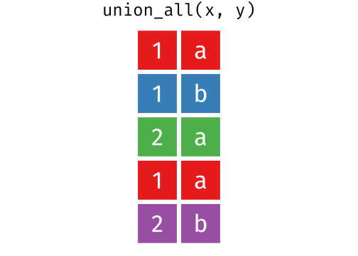

---

layout: true

# Intersection

.grid[
.item[
{{content}}
]
.item[
<br><br>

* Common rows in both `x` and `y`, keeping just unique rows.


]
]

.footnote[
GIF credit: Garrick Aden-Buie
]

---


---

count: false

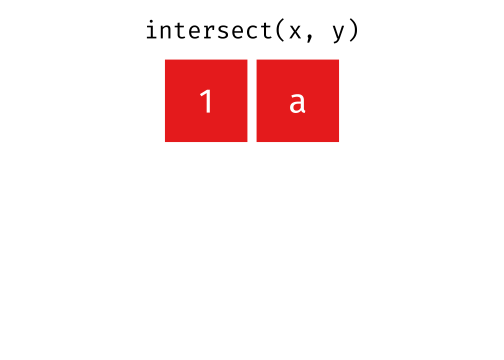

---

layout: true

# Set difference

.grid[
.item[
{{content}}
]
.item[

<br><br>
* All rows from `x` which are not also rows in `y`, keeping just unique rows.


]
]

.footnote[
GIF credit: Garrick Aden-Buie
]


---


---

count: false

<br>


---

layout: true

# Set difference reversed

.grid[
.item[
{{content}}
]
.item[
<br><br>
* All rows from `y` which are not also rows in `x`, keeping just unique rows.


]
]

.footnote[
GIF credit: Garrick Aden-Buie
]


---


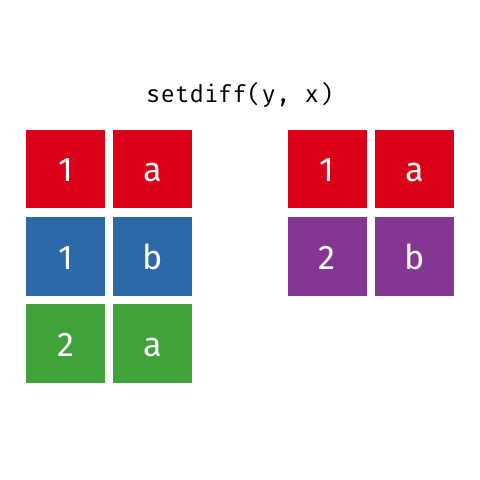

---

count: false

<br><br>
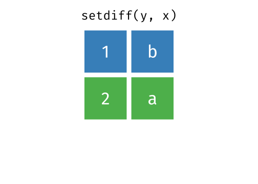

---

layout: false

# Joining by multiple columns

.grid[
.item[
```{r, echo = FALSE}
x <- tibble(year = c(2010, 2010, 2011),
            site = c("A", "B", "B"),
            value = c(1, 3, 2))
y <- tibble(year = c(2010, 2010),
            loc = c("A", "B"),
            value = c(1, 4),
            resp = c(5.4, 3.0))
```
```{r}
x
y
```

]
.item[
{{content}}
]

]

--

```{r}
x %>% 
  left_join(y, 
            by = c("year", "site" = "loc"), #<<
            suffix = c("_x", "_y"))
```


---

class: transition middle

# Nesting data with `tidyr`

---

# Nest data

.grid[
.item50[
```{r}
df %>% as_tibble()
```
]
.item50[

{{content}}

]

]

--

```{r, comment = "#"}
df %>% 
  nest(weather = period:temperature)
```

---

# Using nested data: `rowwise`


```{r, comment = "#"}
df %>% 
  nest(weather = period:temperature) %>% 
  rowwise() %>% #<<
  mutate(avg_temp = mean(weather$temperature)) #<<
```
---

# Using nested data: `group_by`

* `rowwise` is different to using `group_by` even if `group_by` refers to each row

```{r, comment = "#"}
df %>% 
  nest(weather = period:temperature) %>% 
  group_by(year, variety) %>% #<<
  mutate(avg_temp = mean(weather[[1]]$temperature)) #<<
```


---

class: transition middle

# Tidy model output with `broom`


---

# Model outputs are generally messy


```{r}
fit <- lm(speed ~ dist, data = cars)
summary(fit)
```

---

# `broom::tidy` 


```{r}
fit <- lm(speed ~ dist, data = cars)
tidy(fit)
```
---

count: false

# `broom::tidy` and `broom::glance`

```{r}
fit <- lm(speed ~ dist, data = cars)
tidy(fit)
```

```{r}
glance(fit)
```

---

# `broom::augment`

```{r}
fit %>% 
  augment()
```
---

class: transition middle

# Dealing with non-syntatic names with `janitor`


---

# Non-syntatic variable names

.info-box.pad20[
Syntatic names consist of letters, digits, . and _ only and begin with letters or . _and_ also cannot be in reserved words list (`?Reserved`)

]
.grid[.item[
* E.g. "`loc@nsw`", "`Frog ID`" and "`_name`" are non-syntatic names
* E.g. "`nsw_yield`", "`var1`" and "`.valid`" are syntatic names
* Non-syntatic names must be referred with a backtick

]
.item[

{{content}}

]
]


--

```{r}
tmp <- tibble(`=non-syntatic` = 1:2)
tmp$`=non-syntatic`
`1` <- 2
`1`
```

---

# `janitor::clean_names`

.grid[
.item[
* It's usually easier to transform names to syntatic names rather than constantly referring to them by using backticks
* But rename one at a time is a pain
```{r, include = FALSE}
ns <- tibble(`Frog id` = 1:3,
                `weight (kg)` = c(40, 23, 4),
                `1980` = c(4.3, 3.0, 1.5))
```
```{r}
ns
```

]

.item[
{{content}}
]

]

--

* The `clean_names` function in `janitor` is super handy

```{r}
ns %>% 
  clean_names()
```
* I use this A LOT

---

class: transition middle

# Adorn tables with `janitor`

---

layout: true

# Tables


```{r, include = FALSE}
count <- tibble(site = c("A", "B", "C"),
                `1980` = c(40, 20, 10),
                `1981` = c(30, 40, 10))
```
.grid[
.item[
* You can make nicer looking tables for publication using the `adorn_*` functions in `janitor`
```{r}
count
```

]
.item[

{{content}}

]

]

---

---

count: false

```{r}
count %>% 
  adorn_totals(c("row", "col"))
```


---

count: false

```{r}
count %>% 
  adorn_totals(c("row", "col")) %>% 
  adorn_percentages() 
```

---

count: false

```{r}
count %>% 
  adorn_totals(c("row", "col")) %>% 
  adorn_percentages() %>% 
  adorn_pct_formatting(digits = 0)
```

---


count: false

```{r}
count %>% 
  adorn_totals(c("row", "col")) %>% 
  adorn_percentages() %>% 
  adorn_pct_formatting(digits = 0) %>% 
  adorn_ns("front")
```

---

count: false

```{r, eval = FALSE}
count %>% 
  adorn_totals(c("row", "col")) %>% 
  adorn_percentages() %>% 
  adorn_pct_formatting(digits = 0) %>% 
  adorn_ns("front") 
```
<br>
```{r, echo = FALSE}
count %>% 
  adorn_totals(c("row", "col")) %>% 
  adorn_percentages() %>% 
  adorn_pct_formatting(digits = 0) %>% 
  adorn_ns("front") %>% 
  knitr::kable() 
```

---

layout: false

```{r exerciseslide, child="assets/exerciseslide.Rmd"}
```

---

```{r endslide, child="assets/endslide.Rmd"}
```
